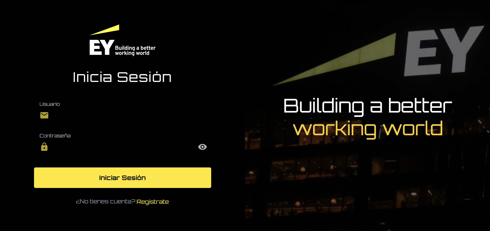
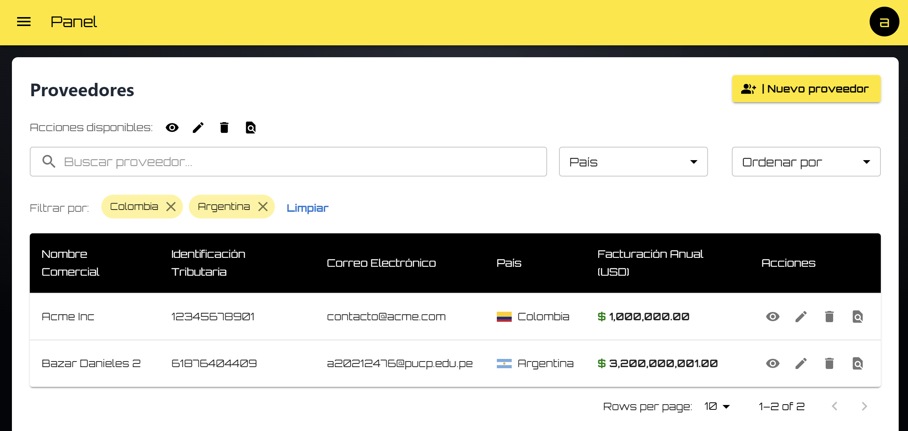
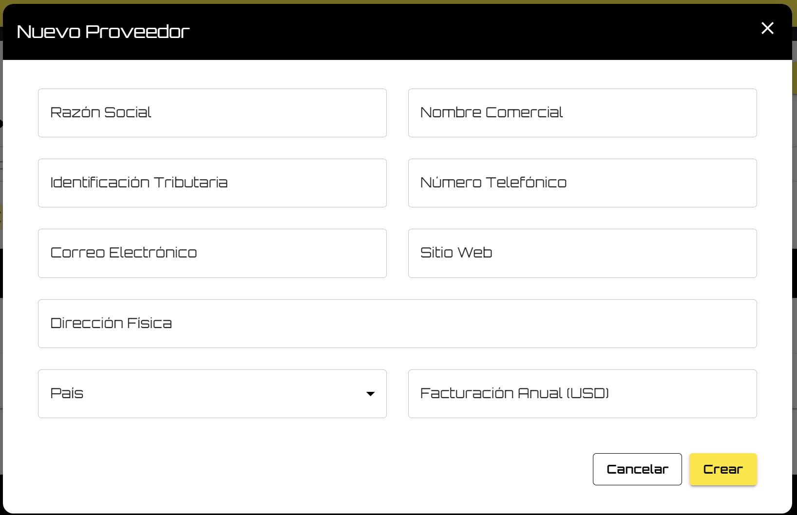
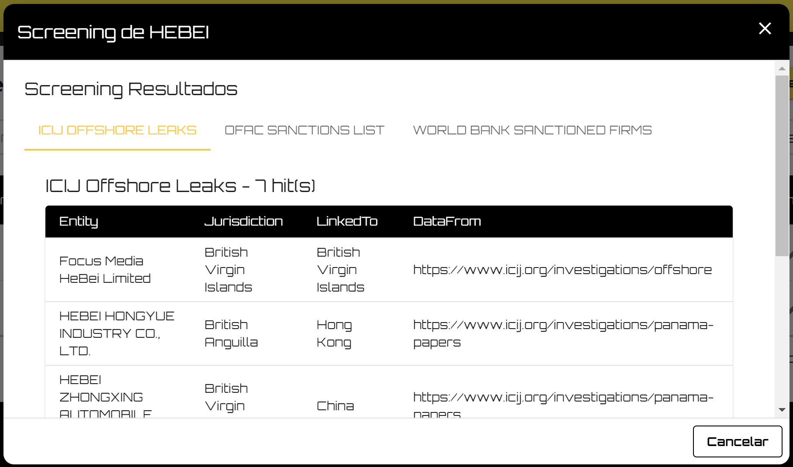

# **Prueba Técnica .NET Developer EY - Front-End**

Este repositorio contiene la implementación del **front-end** de la prueba técnica para el puesto de **Fullstack Jr**. La aplicación es una **Single Page Application (SPA)** desarrollada en **React** con **Vite** como herramienta de construcción rápida y eficiente. Este proyecto consume los endpoints del **back-end** y proporciona una interfaz intuitiva para gestionar el inventario de proveedores y realizar el cruce de listas de alto riesgo.

---

## **Características del Front-End**

- **Gestión de Proveedores**: Creación, edición, eliminación y visualización de proveedores.
- **Validaciones de Formularios**: Validaciones amigables para los campos obligatorios (e.g., email, número de teléfono, etc.).
- **Interfaz Interactiva**: La interfaz sigue el formato SPA, donde todo se gestiona en una sola página.
- **Consumo de Endpoints del Back-End**: Implementación de peticiones **GET**, **POST**, **PUT** y **DELETE** hacia la API.
- **Pantalla de Resultados de Screening**: Muestra los resultados del cruce de listas de alto riesgo de manera estructurada.
- **Estilo y UX**: Usa **Material UI ** para componentes estilizados y responsivos.

---

## **Requisitos Previos**

- **Node.js**: [Descargar aquí](https://nodejs.org/) (versión LTS recomendada).
- **Yarn**: Instalado globalmente en tu sistema:
  ```bash
  npm install --global yarn
  ```
- **Git**: Para clonar el repositorio.

---

## **Configuración Inicial**

1. **Clonar el repositorio**
   ```bash
   git clone https://github.com/Danielrp551/PRUEBA_TECNICA_EY_FRONT.git
   cd PRUEBA_TECNICA_EY_FRONT
   ```

2. **Instalar dependencias**
   ```bash
   yarn install
   ```

3. **Variables de entorno**
   - El proyecto incluye un archivo `.env.development` con las siguientes variables de entorno para el entorno de desarrollo:
     ```env
     VITE_API_URL=http://localhost:5098/api
     ```
   - El archivo para producción (`.env.production`) debe ser configurado localmente y **no está incluido en el repositorio** para mantener la seguridad de las credenciales y configuraciones sensibles.

---

## **Ejecución del Proyecto en Desarrollo**

1. Inicia la aplicación en modo desarrollo:
   ```bash
   yarn dev
   ```
2. La aplicación estará disponible en `http://localhost:5173` (o el puerto que indique la consola).

---

## **Construcción para Producción**

1. Genera los archivos estáticos optimizados:
   ```bash
   yarn build
   ```
2. Los archivos generados estarán en la carpeta `dist/`.

3. Para probar la build localmente:
   ```bash
   yarn preview
   ```
   Esto levantará un servidor local para visualizar la aplicación optimizada.

---

## **Despliegue**

### **Despliegue en Vercel**
El despliegue en producción se realizó en [**Vercel**](https://vercel.com/), una plataforma de hosting especializada para aplicaciones **React/Vite** y proyectos JAMstack.

Pasos para desplegar en Vercel:
1. Realiza un fork del repositorio.
2. Inicia sesión en [Vercel](https://vercel.com/) y selecciona la opción para importar tu proyecto desde GitHub.
3. Configura las variables de entorno en Vercel:
   - `VITE_API_URL`: URL del back-end de producción.
4. Selecciona la rama principal (`main` o `master`) para el despliegue.
5. Inicia el despliegue haciendo clic en **Deploy**.
6. Una vez completado el proceso, recibirás una URL pública para acceder a la aplicación desplegada.

---

## **Capturas de Pantalla**

### **Login**


### **Listado de Proveedores**


### **Formulario de Creación de Proveedor**


### **Resultados de Screening**


---

## **Notas Adicionales**
- La URL del back-end utilizada en el entorno de desarrollo se configura en el archivo `.env.development`.
- En producción, debes ajustar el archivo `.env.production` de manera local según tu entorno de despliegue.
